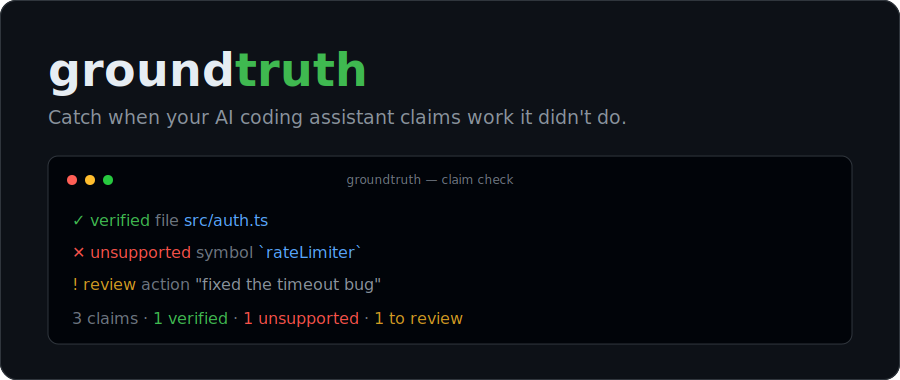

<p align="center">
  
</p>

<p align="center">
  <a href="../../README.md">English</a> ·
  <a href="README.zh-CN.md">简体中文</a> ·
  <a href="README.es.md">Español</a> ·
  <a href="README.pt-BR.md">Português</a> ·
  <a href="README.fr.md">Français</a> ·
  <a href="README.de.md">Deutsch</a> ·
  <b>日本語</b> ·
  <a href="README.ru.md">Русский</a> ·
  <a href="README.ar.md">العربية</a>
</p>

# groundtruth

> **要約** — AI が「完了！X を追加、Y を修正、テストも書きました」と言う。groundtruth は各主張を実際の diff と照合し、実際には行われなかったものを指摘します。コマンド一つ：`npx @twarc_net/groundtruth install`。

**AI コーディングアシスタントが、やっていない作業を「やった」と主張したときに見つけ出す。**

エージェントがターンの最後にこう言います。_「完了！`src/server.ts` に `rateLimiter` ミドルウェアを追加し、タイムアウトのバグを修正し、テストも追加しました。」_ あなたは要約を信じ、コミットして次へ進みます。2 週間後に本番が壊れる——レートリミッターは一度も書かれていなかった。groundtruth は要約を読み、各主張を抽出し、実際に変更された内容（＝ **ground truth**）と照合します。

```text
groundtruth — claim check

  ❌ unsupported  symbol `rateLimiter`
  ❌ unsupported  file src/server.ts
  ❌ unsupported  tests

  3 claims · 0 verified · 3 unsupported
```

> 上記の変更は実際には README を 1 回編集しただけでした。groundtruth は 3 つの虚偽の主張をすべて検出しました。

## なぜ必要か

「ファントム変更」——要約が主張するのに実際には実装されない作業——は、AI エージェントで最も多い不整合です。テストは _間違ったコード_ を捕まえますが、_そもそも書かれていないコード_ は誰も捕まえません。原則はただ一つ：**diff は嘘をつかない。**

## 30 秒で試す

```bash
npx @twarc_net/groundtruth verify --transcript examples/phantom-change.jsonl --no-git
```

## インストール

Node ≥ 20 が必要です。グローバルインストールは不要——フックは `npx` で実行されます。

```bash
# このプロジェクトの Claude Code Stop フックとしてインストール
npx @twarc_net/groundtruth install

# …またはすべてのプロジェクトに
npx @twarc_net/groundtruth install --global
```

Claude Code を再起動（または `/hooks` を実行）すると、groundtruth が毎ターン自動でチェックします。

## 仕組み

ターンを読む → ツール呼び出しと git diff から証拠を集める → 要約から主張を抽出する → 各主張を照合し判定する：

| 判定 | 意味 |
|---|---|
| ✅ **verified** | 主張を裏付ける具体的な証拠がある。 |
| ❌ **unsupported** | 主張は検証可能だが、裏付ける証拠が **一切ない**——ファントム変更。 |
| ⚠️ **review** | 意味的・曖昧（例：_「バグを修正」_）。注意喚起として表示するだけで、失敗とは見なさない。 |

設計上きわめて保守的：主張が明確に検証可能で、何も裏付けがない場合のみ **unsupported** とします——誤って非難するより見逃すほうを選びます。

## 正直な制限

主張された作業が **diff に存在するか** を検証しますが、**正しいか** は検証しません——それはテストの役割です。

## 📖 詳細ドキュメント

詳細ドキュメントは英語です：[README](../../README.md) · [仕組み](../how-it-works.md) · [設計](../design.md)

## ライセンス

[MIT](../../LICENSE) © youcefzemmar
